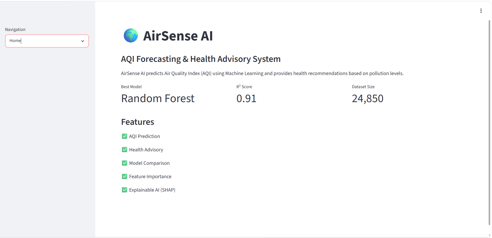
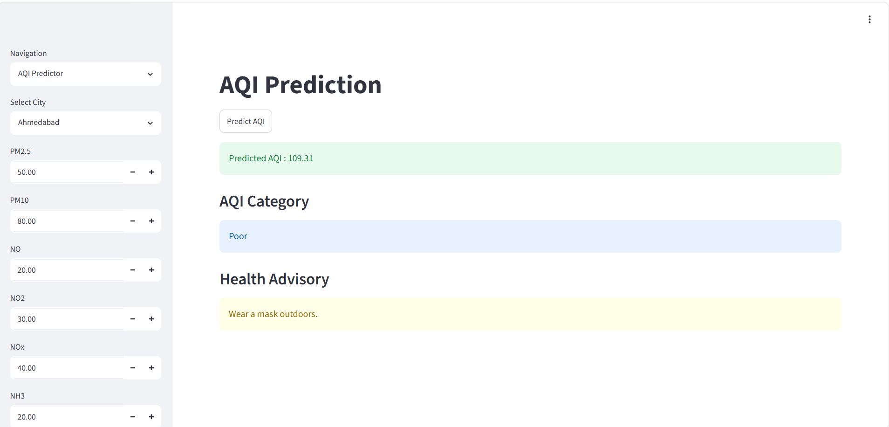
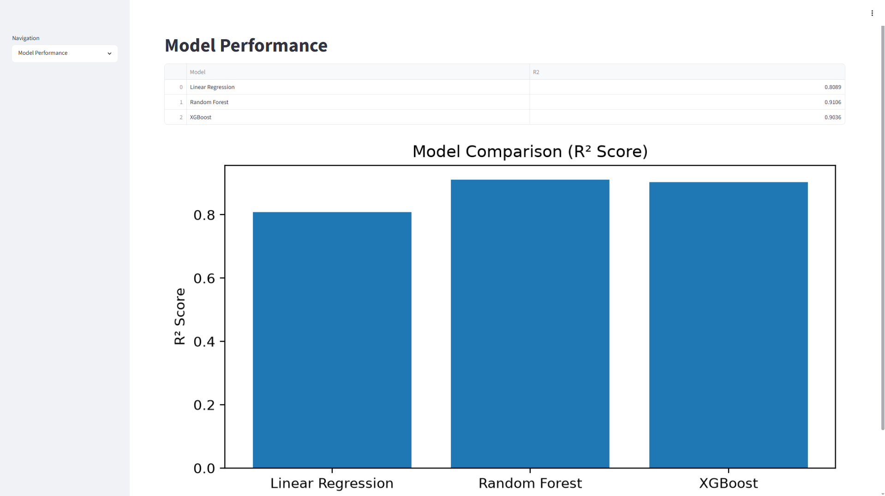
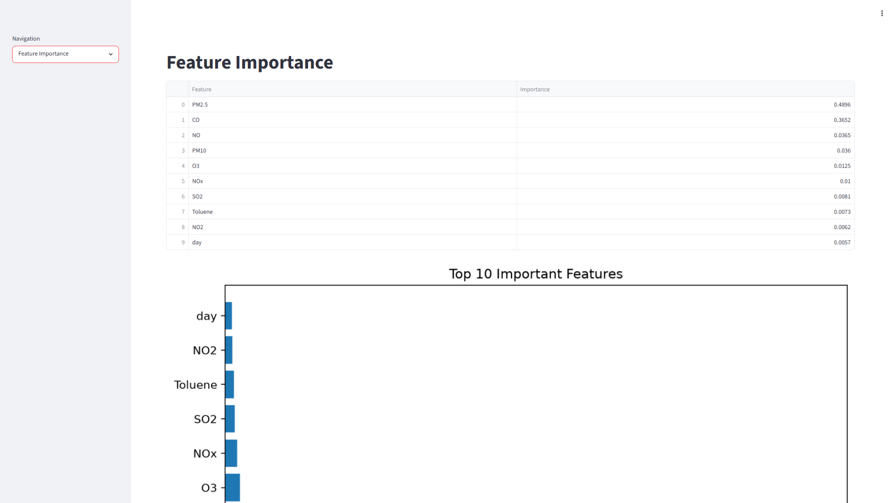
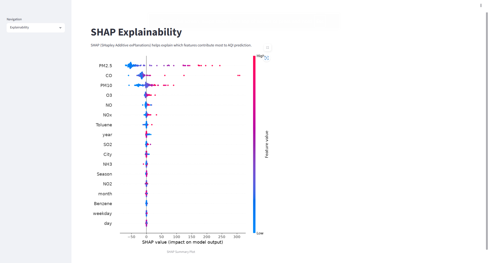

# 🌍 AirSense AI

## AQI Forecasting & Health Advisory System

AirSense AI is an end-to-end Machine Learning project that predicts Air Quality Index (AQI) using environmental pollutant data and provides health recommendations based on predicted pollution levels.

---

## 🚀 Features

* AQI Prediction using Machine Learning
* Health Advisory System
* Multiple Model Comparison
* Feature Importance Analysis
* SHAP Explainability
* Interactive Streamlit Dashboard
* City-wise AQI Prediction
* AQI Category Classification

---

## 📊 Machine Learning Models

| Model             | R² Score |
| ----------------- | -------- |
| Random Forest     | 0.9106   |
| XGBoost           | 0.9036   |
| Linear Regression | 0.8089   |

---

## 🛠 Tech Stack

* Python
* Pandas
* NumPy
* Matplotlib
* Seaborn
* Scikit-Learn
* Random Forest
* XGBoost
* SHAP
* Streamlit

---

## 📁 Project Structure

```text
AQI/
├── dashboard/
├── data/
├── models/
├── notebooks/
├── screenshots/
├── src/
├── README.md
└── requirements.txt
```

## 📷 Project Screenshots

### Home Page



### AQI Predictor



### Model Performance



### Feature Importance



### Explainability



---

## 🎯 Key Features

* Predict AQI using pollutant concentrations.
* Health recommendations based on AQI.
* Feature importance visualization.
* SHAP explainability.
* Interactive dashboard.

---

## 📈 Best Model

Random Forest Regressor

* RMSE: 40.45
* R² Score: 0.9106

---

## 👨‍💻 Author

Pranjal Jain

B.Tech CSIT Student

Machine Learning & Data Science Enthusiast
